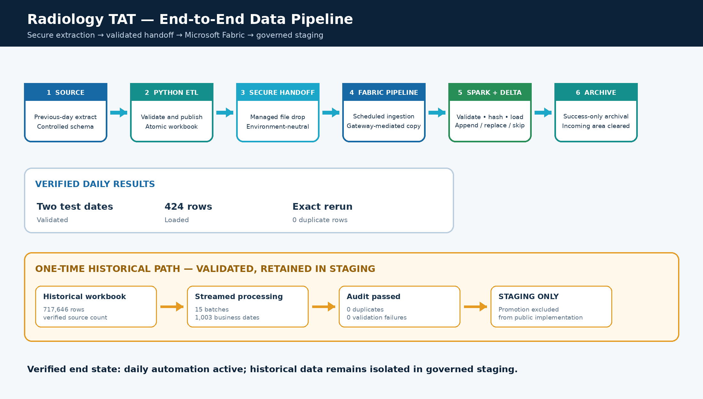
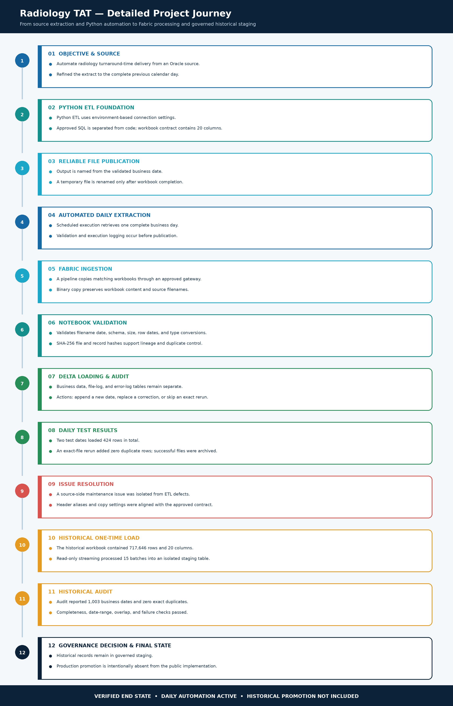
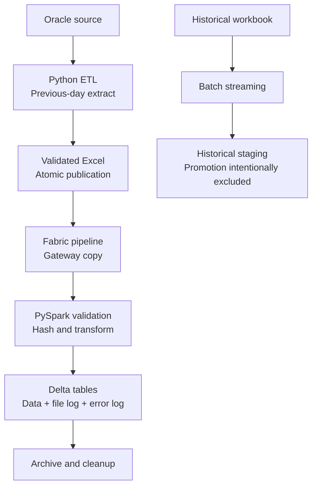

# Radiology TAT Oracle-to-Fabric Pipeline

A sanitized portfolio reference implementation of an end-to-end healthcare analytics pipeline: an on-premises Oracle extract is validated and published as Excel, ingested through Microsoft Fabric, transformed with PySpark, stored in Delta Lake, audited, deduplicated, and archived.

> This repository is a public-safe reconstruction of a real project architecture. It contains synthetic data, placeholder infrastructure values, and no production credentials, patient data, internal hostnames, or organization-specific paths.

## Architecture

### Single-page project flow

The compressed view summarizes the daily production path, verified results, and the separately governed historical-staging branch.



### Detailed project journey

The detailed view documents the implementation chronologically, including ETL construction, Fabric ingestion, validation controls, issue resolution, testing, historical processing, and the final governance decision.



### Mermaid architecture

The Mermaid version below provides a lightweight, editable representation for GitHub and other Markdown tooling.



## Key behaviors

- Extracts the complete previous calendar day from Oracle.
- Validates a controlled 20-column workbook contract.
- Publishes files atomically using a temporary `.part` file.
- Uses SHA-256 file and record hashes for lineage and duplicate protection.
- Supports `APPEND_NEW_DATE`, `REPLACE_CORRECTED_DATE`, and `SKIP_EXACT_DUPLICATE`.
- Writes separate Delta business-data, file-log, and error-log tables.
- Archives source files only after successful validation and loading.
- Keeps the one-time historical workflow separate from daily production.

## Repository map

```text
src/radiology_etl/       Python ETL package
sql/                     Parameterized Oracle SQL templates
fabric/notebooks/        Public-safe Fabric notebook source
fabric/pipelines/        Pipeline design and parameter template
config/                  Environment-variable configuration template
docs/                    Architecture, setup, controls, and security notes
tests/                   Unit tests using synthetic data
sample_data/             Non-sensitive example input
scripts/                 Local validation and scheduling examples
```

## Quick start

```bash
python -m venv .venv
source .venv/bin/activate        # Windows: .venv\Scripts\activate
pip install -r requirements-dev.txt
cp .env.example .env
pytest
python scripts/validate_repository.py
```

To exercise the ETL without Oracle, use the synthetic-data path:

```bash
python -m radiology_etl.cli --config config/config.example.yaml --source-csv sample_data/radiology_tat_sample.csv
```

## Production adaptation

The project deliberately keeps connection details outside source control. Set the required environment variables, review the column contract, provide an approved SQL query, configure a Fabric gateway connection, and import/recreate the documented pipeline activities.

See [Setup Guide](docs/setup-guide.md), [Data Quality Controls](docs/data-quality-controls.md), and [Public Release Checklist](docs/public-release-checklist.md).

## Verified project scale represented by this design

- Daily validation demonstrated across two files totaling 424 rows.
- Exact-file rerun added zero duplicate rows.
- Separate historical staging exercise validated 717,646 rows across 1,003 business dates.
- Historical promotion is intentionally not included as an executable step.

## License

MIT. See [LICENSE](LICENSE).
