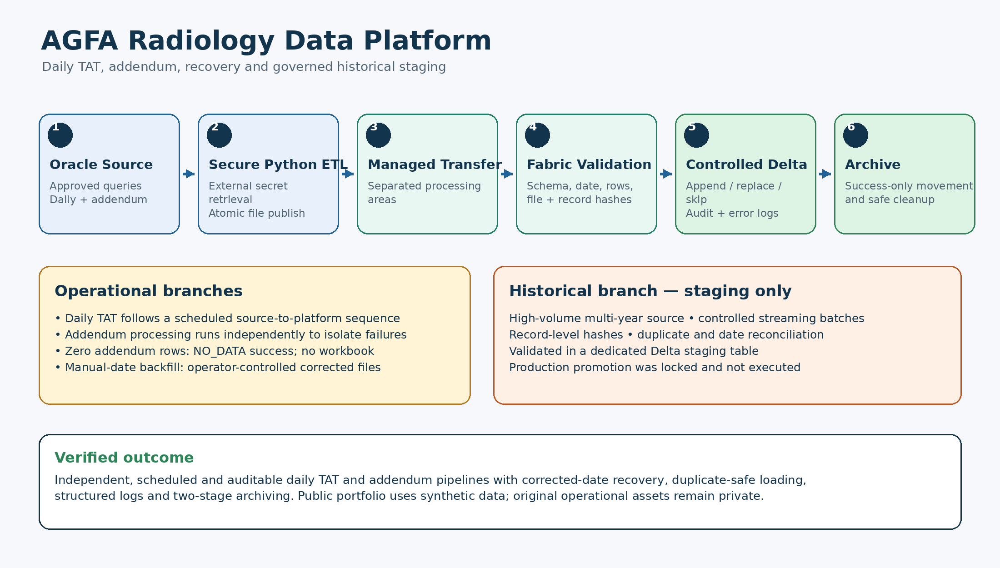
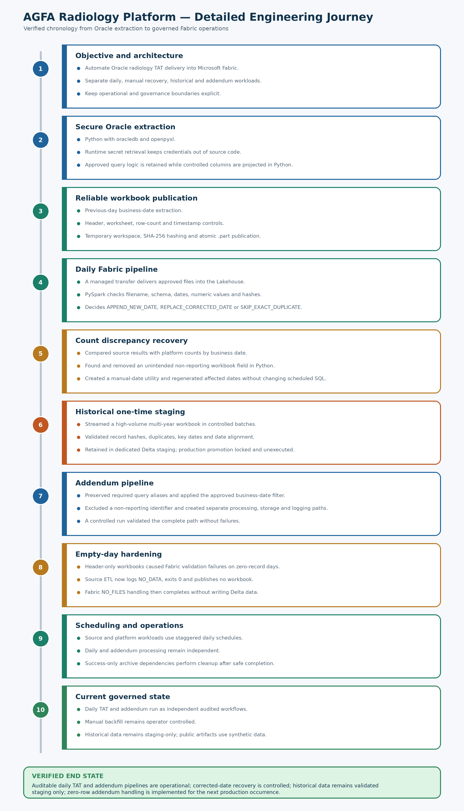
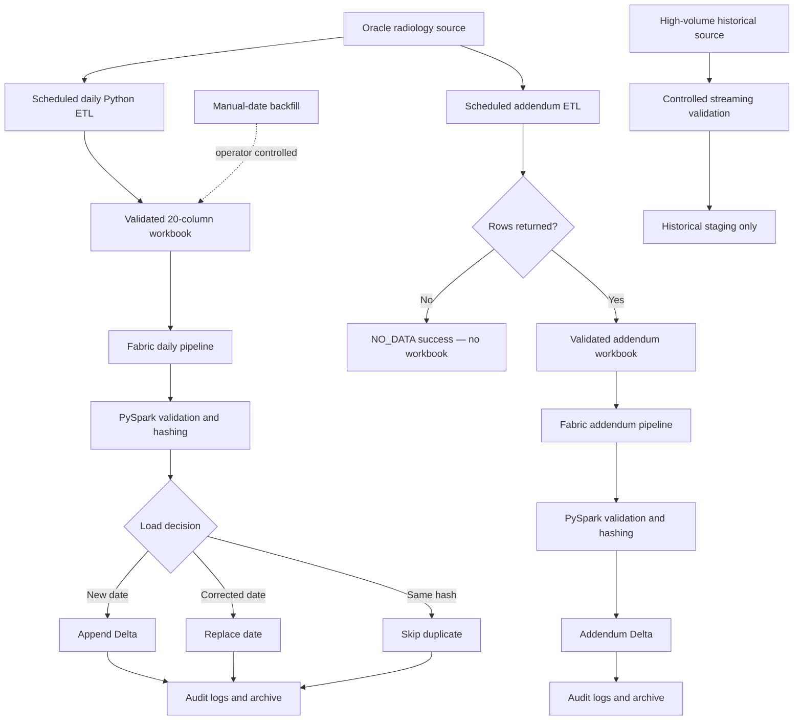

# Radiology TAT and Addendum Oracle-to-Fabric Platform

A public-safe reference implementation of an end-to-end healthcare data platform that extracts daily radiology turnaround-time (TAT) and report-addendum data from Oracle, publishes validated workbooks, ingests them through Microsoft Fabric, applies PySpark quality controls, writes governed Delta tables, and archives successful inputs.

> This repository is a sanitized reconstruction of a production architecture. It contains synthetic records, generic infrastructure placeholders and reconstructed notebook/pipeline examples. It contains no production credentials, patient data, internal hosts, network shares or tenant identifiers.

## Architecture overview



## Detailed engineering journey



## Editable Mermaid flow



Editable source: [docs/architecture-flow.mmd](docs/architecture-flow.mmd).

## Core capabilities

- Previous-calendar-day extraction with explicit half-open date boundaries.
- Separate daily TAT and addendum workloads, schedules, folders and Delta tables.
- Controlled TAT and addendum workbook contracts.
- Atomic `.part` publication so downstream processes never read incomplete files.
- SHA-256 file and deterministic record hashes for lineage and duplicate protection.
- `APPEND_NEW_DATE`, `REPLACE_CORRECTED_DATE` and `SKIP_EXACT_DUPLICATE` decisions.
- Safe addendum `NO_DATA` outcome that exits successfully without publishing an empty workbook.
- Business, file-audit and error-log Delta tables.
- Success-only archival in both source and Fabric environments.
- Operator-controlled manual-date recovery for corrected historical dates.
- Streaming historical staging kept separate from daily production.

## Repository map

```text
.github/workflows/        Continuous integration
config/                   Public-safe configuration examples
docs/                     Architecture, controls, setup and portfolio writing
docs/images/              Summary and detailed PNG diagrams
fabric/notebooks/         Reconstructed public-safe PySpark notebook sources
fabric/pipelines/         Portable pipeline design and parameter examples
sample_data/              Synthetic non-sensitive records
scripts/                  Validation and scheduling examples
sql/                      Sanitized extraction and validation SQL
src/radiology_etl/        Modular Python reference implementation
tests/                    Unit tests for contracts, hashing and empty-day behavior
```

## Quick start

```bash
python -m venv .venv
# Windows: .venv\Scripts\activate
# Linux/macOS: source .venv/bin/activate
pip install -r requirements-dev.txt
pytest
python scripts/validate_repository.py
```

Exercise the reference ETL with synthetic data:

```bash
python -m radiology_etl.cli --config config/config.example.yaml --source-csv sample_data/radiology_tat_sample.csv
```

## Reliability model

| Condition | Controlled outcome |
|---|---|
| New business date | Append validated records |
| Corrected file for an existing date | Replace that date after validation |
| Exact successful file hash | Skip without duplicating records |
| Addendum query returns zero rows | Log `NO_DATA`, exit successfully, publish no workbook |
| Workbook schema/date validation fails | Write error context; do not write business data |
| Notebook succeeds | Archive in Fabric and then archive the source copy |
| Notebook fails | Preserve Incoming files for investigation and retry |

## Verified project evidence

- A high-volume, multi-year historical source was processed through controlled streaming validation.
- Record-level hashing and date reconciliation verified completeness without loading the full source into memory.
- The audit found **zero exact duplicates**, **zero missing key dates** and **zero date mismatches**.
- The first controlled addendum load completed successfully with zero failures.
- Historical promotion was deliberately locked and not executed.

These numbers describe the verified implementation. Repository samples are synthetic and intentionally small.

## Public reconstruction boundary

The modules, SQL templates, Fabric notebook sources and pipeline descriptions are public-safe reference implementations—not asserted byte-for-byte production exports. Deployment requires approved queries, organization-specific connections, secret management, gateway configuration and environment review.

- [Architecture](docs/architecture.md)
- [Setup guide](docs/setup-guide.md)
- [Data-quality controls](docs/data-quality-controls.md)
- [End-to-end project summary](docs/portfolio/end-to-end-project-summary.md)
- [LinkedIn project post](docs/portfolio/linkedin-project-post.md)
- [Short LinkedIn project post](docs/portfolio/linkedin-project-post-short.md)
- [Three-line resume summary](docs/portfolio/resume-summary.md)
- [Resume bullet variant](docs/portfolio/resume-bullets.md)
- [Verified evidence register](docs/portfolio/verified-evidence-register.md)
- [Completed and deferred work register](docs/portfolio/completed-and-deferred-register.md)
- [Diagram interpretation](docs/architecture/diagram-notes.md)
- [Public release checklist](docs/public-release-checklist.md)

## License

MIT — see [LICENSE](LICENSE).
